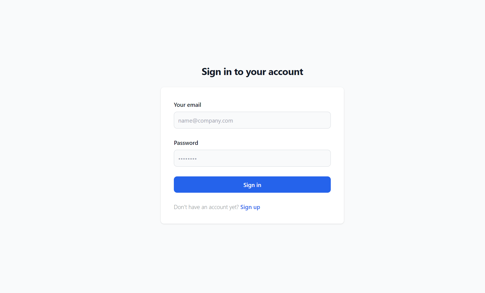
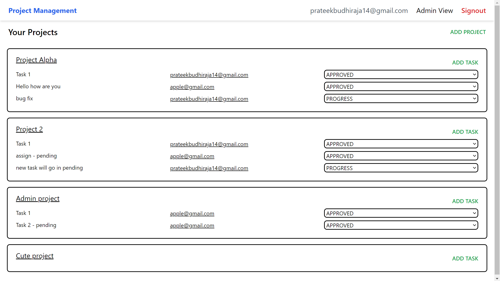
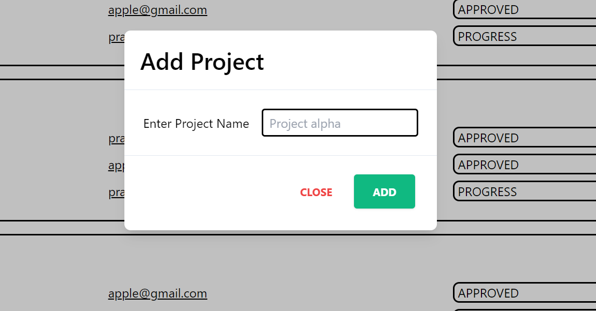
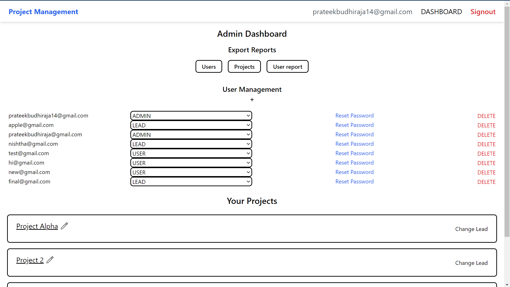
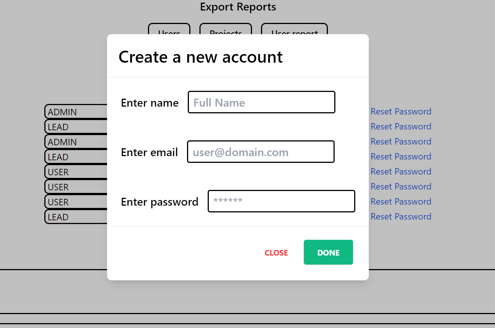

# Project Management

A project management app with APIs to create, edit and delete projects, users according to the user role along with a frontend with which these APIs can be called.

## Tech Stack

**Client:** React, Tailwind

**Server:** Node, Express

**Database:** MongoDB

## Installation

### Environment Variables backend

To run this project, you will need to add the following environment variables to your server/.env file (sample data is given at server/.env_example)

`PORT`
`MONGO_URI`
`JWT_EXPIRY`
`JWT_SECRET`

### Environment Variables frontend

To run this project, you will need to add the following environment variables to your client/.env file (sample data is given at client/.env_example)

`REACT_APP_SERVER_URL`

Use the below steps to setup this project on your local system.

- Clone this git repository

```bash
git clone https://github.com/prateek-budhiraja/project-management.git
```

- Go to the server folder, and rename `.env_example` file to `.env`.

- Change the environment variable value if required (to match your setup).

- To create first Admin account, uncomment below lines from `app.js`

```
// import { createFirstAdmin } from "./backdoor.js";
// createFirstAdmin();
```

- To setup backend server, use the below commands

```bash
cd project-management/backend
npm install
npm run dev
```

- Now the backend would be running at http://localhost:4000/ (if port is not changed in .env file)

- Note: Comment two lines that were uncommented earlier from `app.js`

- Now move to client folder and create `.env` file with variables in `.env_example`

- To start frontend, use the below commands

```bash
cd ../client
npm install
npm start
```

- Now the frontend would be accessable at http://localhost:3000/

## Screenshots






